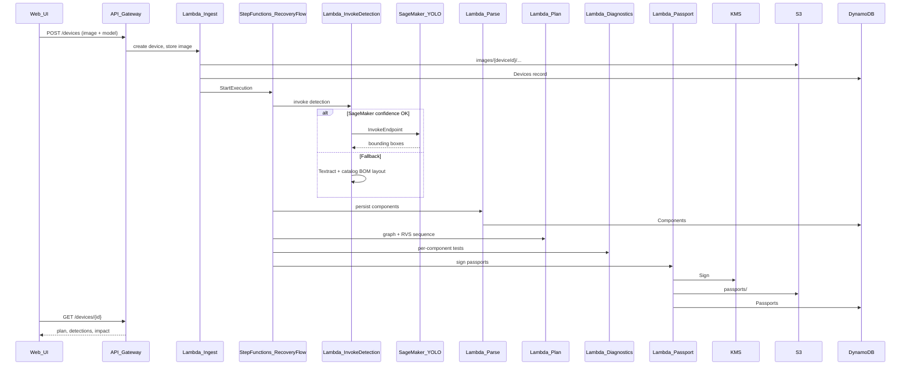

# Architecture

## Overview

RE:GENESIS is a serverless pipeline on AWS. A technician or facility operator uploads an interior photo of decommissioned hardware (or selects a known model). The system detects components, audits completeness against the device catalog, produces an RVS-ranked disassembly plan, runs simulated diagnostics, and mints KMS-signed passports for parts qualified for reuse.

## High-level flow

## Detection path selection

| Path | When | Label in API |
|------|------|----------------|
| `sagemaker` | Endpoint configured, mean confidence ≥ threshold, count within catalog tolerance | `vision` |
| `catalog_assisted` | Low confidence, missing endpoint, or BOM mismatch | `catalog-assisted` |
| `mock` | `DETECTION_MODE=mock` (local/SAM tests) | `mock` |

**Model plate OCR (I-3.1.3):** In `DETECTION_MODE=auto`, InvokeDetection runs **Tesseract** (Lambda layer) on the uploaded image (or uses optional `plate_text`), matches catalog `ocr_hints`, and may **confirm** or **influence** `device_model_key`. Persisted as `ocr_confirmed` / `ocr_matched_hints` / `ocr_engine`.

## Failure handling

- Step Functions retries Lambda service errors (2x, backoff).
- Detection failures route to catalog-assisted path when `ALLOW_DETECTION_FALLBACK=true`.
- Each stage writes to `PipelineEvents` for audit.

## S3 key conventions

| Prefix | Content |
|--------|---------|
| `images/{device_id}/original.jpg` | Upload |
| `images/{device_id}/crops/{component_id}.jpg` | Optional crops |
| `logs/{device_id}/tests/{component_id}.json` | Diagnostic output |
| `passports/{passport_id}.json` | Signed passport document |

## Security

- KMS asymmetric key: sign canonical passport JSON (no `signature` field).
- S3 buckets block public access; UI uses presigned URLs or API-mediated reads.
- IAM least privilege per Lambda; Step Functions uses dedicated role.
